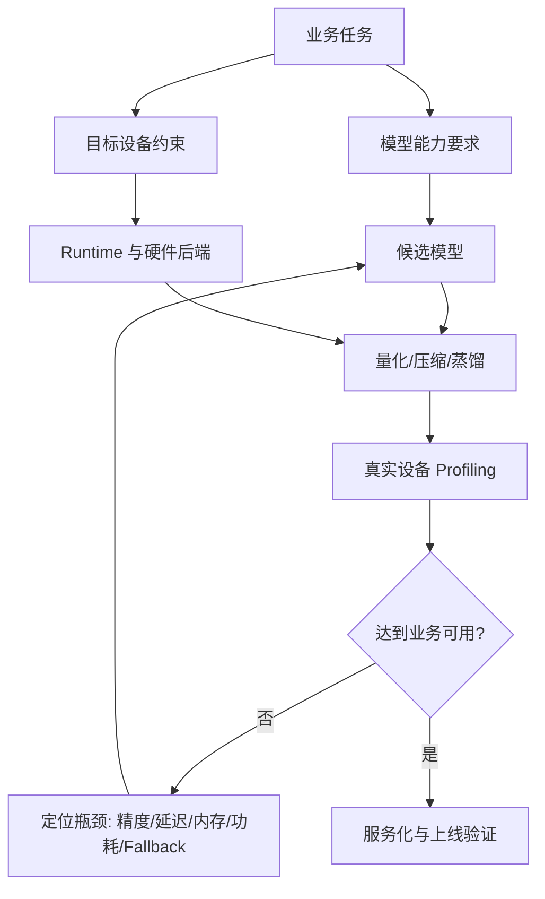

# 端侧部署问题框架

## 建议学时

4 学时。2 学时讲端侧部署场景和指标体系，1 学时讲 Ubuntu Server 与 Jetson 的硬件约束差异，1 学时做项目评估讨论。

## 学习目标

- 建立端侧 AI 部署的整体判断框架。
- 区分模型能力、设备资源、runtime、功耗散热、网络环境和产品体验之间的约束关系。
- 明确量化、压缩、蒸馏和推理框架选型分别解决什么问题。
- 为后续 Ubuntu/Qwen 实作建立统一的指标语言。
- 为 Jetson 端侧实验建立功耗、温度和稳定性指标。

## 问题背景

端侧推理重新受到重视，不只是因为设备算力提升。更直接的原因是云端推理在隐私、延迟、弱网、成本和个性化体验上存在天然限制。手机、PC、车载、IoT、工业终端、摄像头和机器人等场景，都要求模型在受限资源内稳定工作。

端侧部署不是把云端模型直接搬到设备上运行，而是要先定义“业务可用”的边界：精度够不够、首 token 是否能接受、tokens/s 是否稳定、内存峰值是否越界、长时间运行是否降频、失败时能否恢复。

## 图示讲解



## 核心概念

| 维度 | 需要回答的问题 | 常见指标 |
| --- | --- | --- |
| 任务能力 | 模型是否完成核心任务 | accuracy、F1、BLEU、人工评分、格式正确率 |
| 交互体验 | 用户是否觉得可用 | 首 token 延迟、端到端延迟、tokens/s |
| 资源占用 | 设备是否承受得住 | 模型文件大小、VRAM/RAM 峰值、KV Cache |
| 稳定性 | 长时间运行是否退化 | 温度、功耗、降频、错误率 |
| 工程成本 | 是否能维护和发布 | runtime 复杂度、模型更新、依赖大小、许可证 |

## Ubuntu Server 与 Jetson 的差异

| 维度 | Ubuntu Server + NVIDIA GPU | Jetson |
| --- | --- | --- |
| 主要价值 | 快速验证、调参、较高算力 | 接近真实边缘设备，能看功耗和热稳定性 |
| 内存形态 | 独立显存常见 | 统一/共享内存更常见 |
| 监控工具 | `nvidia-smi` | `tegrastats`、`nvpmodel` |
| 主要风险 | GPU offload、driver/CUDA、服务化 | 功耗模式、温度、热降频、存储和内存限制 |

课程实作会先在 Ubuntu Server 上建立 baseline，再迁移到 Jetson，观察同一模型在不同硬件约束下的表现。

后续章节中的 PTQ、QAT、GPTQ、AWQ、SmoothQuant、KV Cache 量化、剪枝、蒸馏和 runtime 选型，都要回到这张表验证。

## 代码/命令示例

用一份简单的检查清单记录目标设备，而不是先开始调模型：

```bash
uname -a
lscpu
free -h
df -h
nvidia-smi
python3 --version
```

把输出粘到实验记录中，用于解释后续速度和显存差异。

## 配套实作

对应实作章节：[Ubuntu Server 与 NVIDIA GPU 环境](/docs/lab-ubuntu-nvidia)。
Jetson 分支见：[Jetson 环境与 Qwen 迁移](/docs/lab-jetson-setup)。

任务是建立环境基线：

- 记录 OS、CPU、内存、磁盘、GPU、驱动、CUDA runtime。
- 确认是否能正常访问 Hugging Face 或 ModelScope 等模型来源。
- 建立实验目录，不把模型权重和构建产物提交到 Git。

## 验收结果

完成后应得到：

| 产物 | 验收标准 |
| --- | --- |
| 设备信息表 | 能说明后续实验跑在哪台机器上 |
| GPU 状态截图或文本 | `nvidia-smi` 能正常显示 GPU、驱动和显存 |
| 实验目录 | 模型文件、第三方源码、构建产物与课程仓库分离 |

## 常见问题

- **只看模型文件大小**：文件变小不代表推理更快，低比特 kernel 和 runtime 支持更关键。
- **只看平均延迟**：交互式 LLM 还要单独看首 token 延迟和 tokens/s。
- **忽略热稳定性**：端侧设备短跑结果可能很好，连续运行后会因温度和功耗限制变慢。
- **混淆开发机与目标设备**：在服务器上跑通不等于手机、车机或嵌入式设备可用。

## 参考资料

- [40/52 学时教学安排](/docs/course-hours)
- [资料对比与课程取舍](/docs/source-comparison)
- [Ubuntu Server NVIDIA driver guide](https://ubuntu.com/server/docs/how-to/graphics/install-nvidia-drivers/)
- [NVIDIA CUDA Installation Guide for Linux](https://docs.nvidia.com/cuda/cuda-installation-guide-linux/)
- [NVIDIA Container Toolkit Install Guide](https://docs.nvidia.com/datacenter/cloud-native/container-toolkit/latest/install-guide.html)
