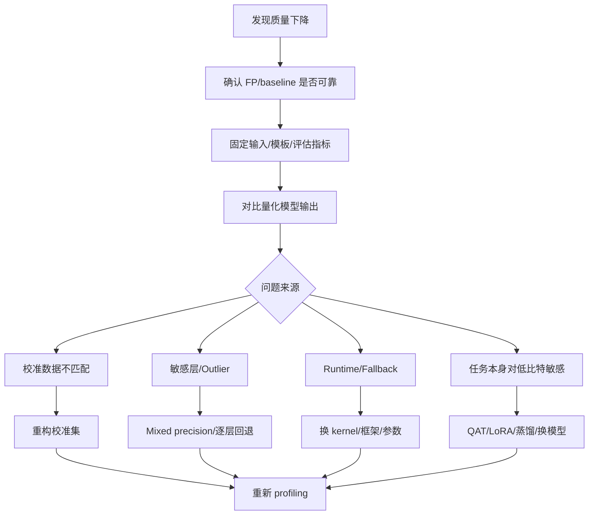

# 量化精度修复

## 学习目标

- 建立量化后精度下降的系统排查流程。
- 区分算法问题、数据问题、导出问题、runtime 行为差异和评估指标问题。
- 掌握校准集重构、敏感层分析、mixed precision、逐层回退、outlier 处理和蒸馏补偿的适用场景。
- 能把速度收益和质量损失放在同一张实验表里决策。

## 问题背景

量化后精度下降不一定来自量化算法本身。分类检测指标下降、生成质量变差、格式错误增多、VLM 细粒度识别退化、Agent 规划不稳定，都可能来自 baseline 不可靠、预处理后处理不一致、导出错误、runtime fallback、prompt/template 差异或评估指标不一致。

修复顺序应该是先确认问题，再定位原因，最后选择修复手段。

## 图示讲解



## 核心概念

| 修复手段 | 解决的问题 | 成本 |
| --- | --- | --- |
| 校准集重构 | 校准分布和真实输入不一致 | 中 |
| 逐层敏感性分析 | 找到量化后最脆弱的层 | 中到高 |
| Mixed precision | 关键层保留高精度 | 中 |
| Clipping/percentile | 降低 outlier 对量化范围的破坏 | 中 |
| LoRA/Adapter | 用较小训练成本补偿能力 | 高 |
| 蒸馏 | 用教师模型修复学生或量化模型表现 | 高 |

## 代码/命令示例

用固定测试集做最小质量检查，避免只凭一两次主观聊天判断：

```json
[
  {
    "id": "quantization_value",
    "prompt": "用三句话解释端侧模型量化的价值。",
    "must_include": ["延迟", "内存", "设备"]
  },
  {
    "id": "format_json",
    "prompt": "请输出 JSON，字段为 method、risk、metric。",
    "must_include": ["method", "risk", "metric"]
  }
]
```

Python 中可以先做格式和关键词 smoke test：

```python
def check_keywords(text: str, keywords: list[str]) -> bool:
    return all(keyword in text for keyword in keywords)
```

## 配套实作

对应实作章节：[Profiling 与结果记录](/docs/lab-profiling)。

在 Qwen 量化对比中，为每个模型记录：

- 是否遵守输出格式。
- 是否出现明显重复、跑题、拒答或事实错误。
- 速度收益是否足以抵质量损失。
- 如果低比特模型质量不可接受，优先尝试换量化类型或回退部分精度，而不是直接扩大模型。

## 验收结果

| 产物 | 验收标准 |
| --- | --- |
| 质量检查集 | 至少包含任务解释、格式输出、长上下文三个维度 |
| 问题定位表 | 能把每个失败样例归入数据、量化、runtime 或任务敏感性 |
| 修复建议 | 每个建议都说明会增加多少工程成本或资源占用 |

## 常见问题

- **没有 FP baseline**：没有可靠基线就无法判断量化是否是问题来源。
- **只做主观聊天体验**：生成模型也需要固定 prompt、固定采样参数和可复查输出。
- **修复后不测性能**：精度修复可能引入高精度层或更大模型，必须重新测延迟和显存。
- **把所有层一起回退**：逐层回退要定位敏感层，否则容易把量化收益全部抵消。

## 参考资料

- [AWQ paper](https://arxiv.org/abs/2306.00978)
- [SmoothQuant paper](https://arxiv.org/abs/2211.10438)
- [Qwen llama.cpp 量化指南](https://qwen.readthedocs.io/en/v2.5/quantization/llama.cpp.html)
