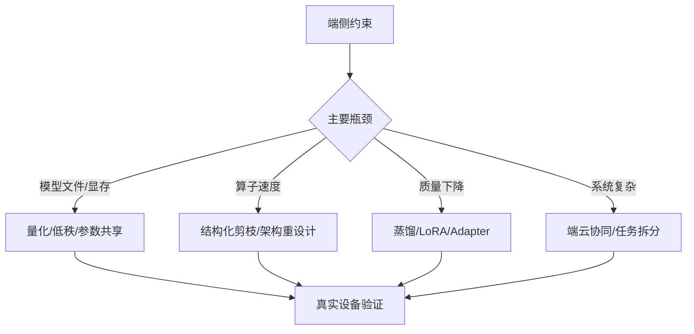

# 压缩与蒸馏

## 学习目标

- 把量化放入完整模型压缩体系中理解。
- 区分剪枝、低秩分解、参数共享、蒸馏、小模型训练和架构重设计的作用。
- 判断什么时候压缩现有模型，什么时候换更端侧友好的模型。
- 理解蒸馏如何用于能力迁移和量化后补偿。

## 问题背景

量化解决的是数值表示和推理效率问题，但并不是所有端侧瓶颈都适合靠量化解决。模型结构过大、算子不适合目标硬件、任务本身过重、上下文过长时，剪枝、蒸馏或重新选择架构可能更有效。

非结构化剪枝虽然理论压缩率高，但未必带来真实端侧加速；结构化剪枝更容易适配硬件，却需要 fine-tuning 和真实设备 profiling 才能证明收益。

## 图示讲解



## 核心概念

| 方法 | 适用场景 | 风险 |
| --- | --- | --- |
| 量化 | 文件、显存、带宽受限 | 质量下降、kernel 不支持 |
| 结构化剪枝 | 需要真实加速，硬件支持规则结构 | fine-tuning 成本高 |
| 非结构化剪枝 | 研究压缩率或稀疏硬件可用 | 通用设备上未必加速 |
| 低秩分解 | 线性层或矩阵计算可近似 | 需要评估误差累积 |
| 知识蒸馏 | 大模型能力迁移到小模型 | 数据构造和评估成本高 |
| 架构重设计 | 原模型本身不适合端侧 | 研发周期更长 |

## 代码/命令示例

蒸馏数据可以先从固定任务样例开始，保留教师输出、学生输出和评价：

```json
{
  "prompt": "解释 INT4 weight-only quantization 的适用场景。",
  "teacher_response": "待填入教师模型输出",
  "student_response": "待填入学生或量化模型输出",
  "judge_note": "待记录差异"
}
```

## 配套实作

对应实作章节：[Profiling 与结果记录](/docs/lab-profiling)。

在本课程的 Qwen 小模型实作中，暂不展开训练式蒸馏，而是先用实验表判断：

- 量化是否已经足够。
- 如果低比特质量不可接受，是不是换一个 Qwen 小模型尺寸更合理。
- 是否需要后续引入 LoRA、Adapter 或蒸馏作为第二阶段任务。

## 验收结果

| 产物 | 验收标准 |
| --- | --- |
| 压缩路线选择表 | 能说明为什么先量化、先剪枝、先蒸馏或直接换模型 |
| 蒸馏样例格式 | 能保存 prompt、教师输出、学生输出、评价备注 |
| 后续训练判断 | 能说明当前是否真的需要训练式补偿 |

## 常见问题

- **剪枝后只看参数量**：真实速度取决于硬件和 runtime 是否利用稀疏或规则结构。
- **蒸馏目标太宽泛**：没有固定任务分布，蒸馏数据质量很难控制。
- **压缩不合适的模型**：如果模型架构天然不适合端侧，换模型可能比压缩更省成本。
- **忽略许可证和发布成本**：小模型选择也要考虑商用许可、分发体积和更新机制。

## 参考资料

- [Qwen llama.cpp 本地运行指南](https://qwen.readthedocs.io/en/v2.5/run_locally/llama.cpp.html)
- [llama.cpp 项目](https://github.com/ggml-org/llama.cpp)
