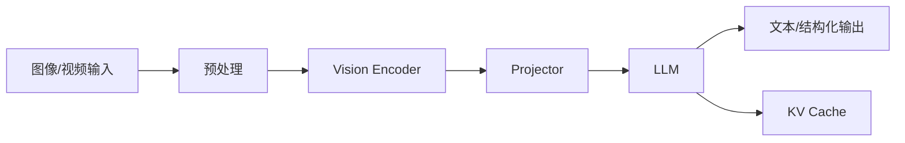
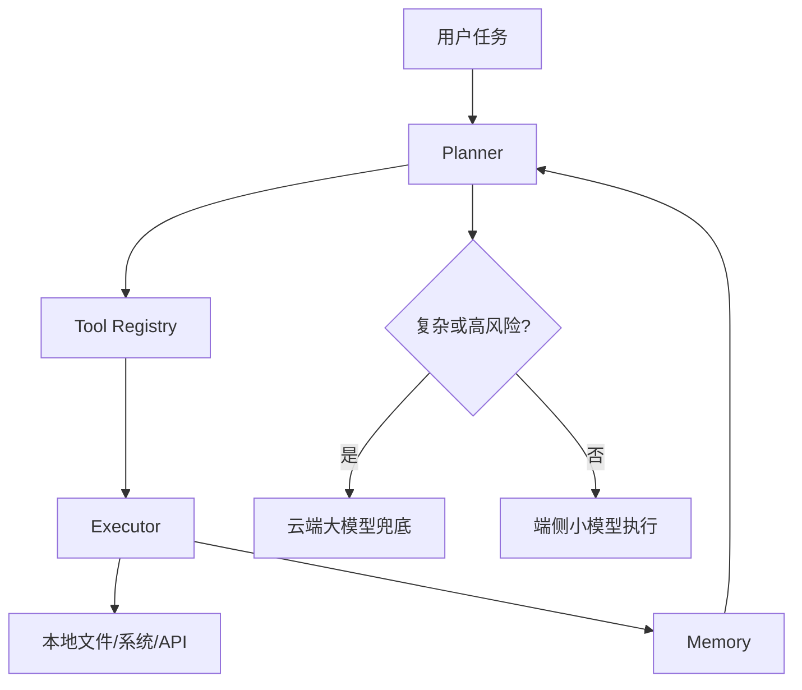

# VLM 与 Agent 端侧形态

## 学习目标

- 区分 VLM 的感知理解链路和 Agent 的规划执行链路。
- 理解 VLM 端侧瓶颈不只在 LLM，还包括图像分辨率、视觉 token、projector 和多模态对齐。
- 理解 Agent 的关键问题包括工具权限、状态管理、失败恢复和端云协同。
- 能把单模型优化扩展到系统级部署判断。

## 问题背景

VLM 与 Agent 的端侧部署已经从单模型优化扩展到系统架构优化。VLM 要处理图像预处理、vision encoder、projector、LLM、tokenizer、多轮上下文和输出后处理；Agent 则包含 planner、tool registry、executor、memory、permission manager、safety policy 和交互循环。

因此，端侧 VLM/Agent 的瓶颈不只是模型大小，还包括输入管线、工具链稳定性、权限边界、本地上下文、失败恢复和端云协同策略。

## 图示讲解





## 核心概念

| 系统 | 主要瓶颈 | 量化关注点 |
| --- | --- | --- |
| VLM | 图像分辨率、视觉 token、projector、OCR、小目标 | 不能只量化 LLM，还要评估视觉链路 |
| Local Agent | 工具调用稳定性、权限边界、状态维护 | 小模型可做轻任务，复杂 reasoning 需兜底 |
| Hybrid Agent | routing、隐私、网络、失败恢复 | 端侧处理隐私/低延迟任务，云端处理复杂任务 |

## 代码/命令示例

Agent 本地服务调用应先固定权限边界，只暴露明确工具：

```json
{
  "allowed_tools": ["read_local_note", "summarize_text"],
  "blocked_tools": ["delete_file", "send_email", "run_shell"],
  "fallback": "cloud_model_when_task_requires_complex_reasoning"
}
```

## 配套实作

对应实作章节：[本地 OpenAI-compatible 服务](/docs/lab-local-service)。

本课程的第一阶段实作不直接部署 VLM 或完整 Agent，而是先完成本地 LLM 服务化。它是后续 VLM/Agent 的基础组件：

- VLM 可以把 LLM server 作为文本推理模块。
- Agent 可以把本地小模型作为低风险任务 planner 或 summarizer。
- 端云协同可以把本地 server 作为隐私优先路径。

## 验收结果

| 产物 | 验收标准 |
| --- | --- |
| VLM 链路图 | 能指出 vision encoder、projector、LLM 各自可能的瓶颈 |
| Agent 权限表 | 能区分允许、拒绝、需要云端兜底的工具 |
| 服务化基线 | 本地 LLM server 可被后续 VLM/Agent 组件调用 |

## 常见问题

- **只压缩 LLM**：VLM 的图像侧和 projector 也可能是瓶颈。
- **忽略工具权限**：Agent 端侧运行更接近真实系统操作，权限边界必须先定义。
- **把端侧当成全离线**：很多产品更适合端云协同，而不是强行全端侧。
- **没有失败恢复**：工具调用失败、网络失败、输出格式错误都需要恢复策略。

## 参考资料

- [Qwen llama.cpp 本地运行指南](https://qwen.readthedocs.io/en/v2.5/run_locally/llama.cpp.html)
- [llama.cpp 项目](https://github.com/ggml-org/llama.cpp)
