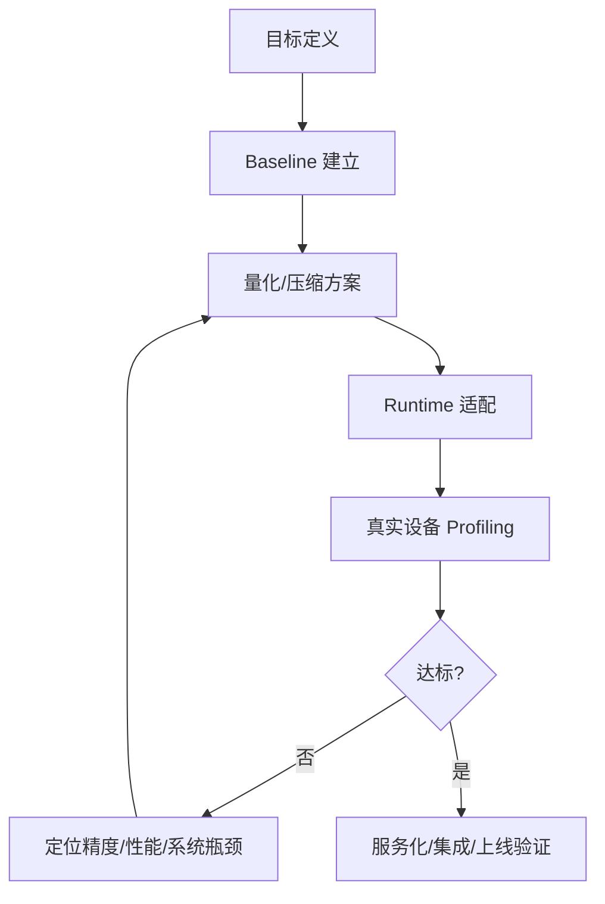

# 案例串联与复盘

## 学习目标

- 把端侧部署问题框架、量化、精度修复、压缩蒸馏、runtime 和系统架构串成完整工程路径。
- 能复盘传统视觉模型、小型 LLM、VLM 和 Hybrid Agent 的不同优化路线。
- 能输出一份可执行的端侧部署评审清单。

## 问题背景

课程最后不再只做 Q&A，而是用案例把全书内容串起来。不同模型形态的优化路径不同，不能用同一套指标粗暴套用。

传统视觉模型更关注 INT8 PTQ/QAT、结构化剪枝、TFLite/NCNN/MNN 和真实设备延迟；小型 LLM 更关注 GGUF、AWQ/GPTQ、INT4/INT5、group size、KV Cache、首 token、tokens/s 和本地 runtime；VLM 和 Hybrid Agent 还需要系统级架构设计。

## 图示讲解



## 核心概念

| 案例类型 | 优化主线 | 关键验收 |
| --- | --- | --- |
| 传统视觉模型 | INT8 PTQ/QAT、结构化剪枝、端侧 runtime | 真实设备延迟、精度指标、功耗 |
| 小型 LLM | GGUF 量化、KV Cache、llama.cpp、API 服务 | 首 token、tokens/s、显存、输出质量 |
| VLM | vision encoder、projector、LLM、视觉 token | OCR、小目标、空间关系、对齐质量 |
| Hybrid Agent | 本地小模型、云端兜底、工具权限、routing | 隐私、失败恢复、权限控制、任务成功率 |

## 代码/命令示例

部署评审清单可以以 Markdown 表格保存，作为每个项目的复盘模板：

```markdown
| 项目 | 当前结论 | 证据 | 下一步 |
| --- | --- | --- | --- |
| Baseline | 待填 | 待填 | 待填 |
| 量化格式 | 待填 | 待填 | 待填 |
| Runtime | 待填 | 待填 | 待填 |
| 首 token | 待填 | 待填 | 待填 |
| tokens/s | 待填 | 待填 | 待填 |
| 峰值显存 | 待填 | 待填 | 待填 |
| 质量风险 | 待填 | 待填 | 待填 |
```

## 配套实作

对应实作章节：

- [Qwen GGUF 量化对比实验](/docs/lab-qwen-quantization)
- [Profiling 与结果记录](/docs/lab-profiling)
- [本地 OpenAI-compatible 服务](/docs/lab-local-service)

最终实作复盘应回答：

- 当前 Qwen 小模型是否达到课程定义的“业务可用”。
- 如果没有，是精度、速度、显存、runtime 还是服务化问题。
- 下一轮应该换量化类型、换模型尺寸、调 runtime 参数，还是改变系统架构。

## 验收结果

| 产物 | 验收标准 |
| --- | --- |
| 小型 LLM 复盘表 | 从目标、baseline、量化、runtime、profiling 到结论完整记录 |
| 风险清单 | 至少覆盖精度、延迟、显存、许可证、模型来源和部署维护 |
| 后续路线 | 能明确下一步是继续优化、换模型、换 runtime 还是端云协同 |

## 常见问题

- **只汇报最好结果**：复盘需要保留失败样例和参数，才能指导下一轮。
- **把模型问题和系统问题混在一起**：输出差、速度慢、服务不稳要分开定位。
- **没有验收阈值**：没有阈值就无法判断“是否达标”。
- **忽略上线后的环境差异**：开发机、测试机和目标设备的驱动、温度、并发和网络都可能不同。

## 参考资料

- [llama.cpp 项目](https://github.com/ggml-org/llama.cpp)
- [Qwen llama.cpp 本地运行指南](https://qwen.readthedocs.io/en/v2.5/run_locally/llama.cpp.html)
- [NVIDIA Container Toolkit Install Guide](https://docs.nvidia.com/datacenter/cloud-native/container-toolkit/latest/install-guide.html)
