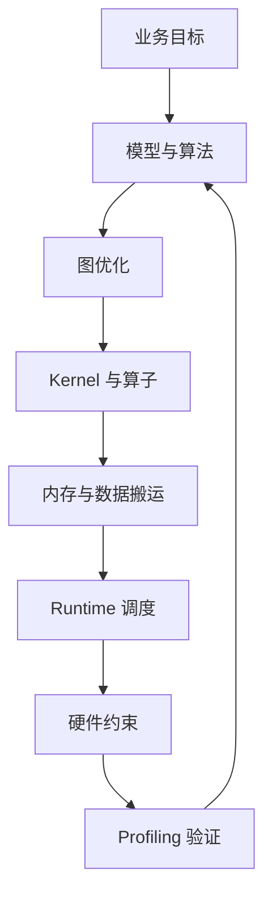

# 推理加速基础

## 建议学时

4 学时。2 学时讲授推理加速分层框架，1 学时讲 LLM 推理加速，1 学时结合日志和实验参数讨论。

## 学习目标

- 理解推理加速不等于量化，量化只是加速链路中的一类手段。
- 能从算法、图优化、kernel、内存、runtime、硬件六层分析瓶颈。
- 理解 LLM 推理中的 prefill、decode、KV Cache、batching 和 GPU offload 对性能的影响。
- 能设计一组简单实验验证某个加速手段是否真实有效。

## 推理加速分层框架



| 层级 | 典型手段 | 风险 |
| --- | --- | --- |
| 模型与算法 | 小模型、蒸馏、剪枝、量化、speculative decoding | 质量下降 |
| 图优化 | constant folding、operator fusion、layout transform | dynamic shape 或 unsupported op 破坏优化 |
| Kernel | GEMM、FlashAttention、低比特 kernel、Tensor Core | kernel 不匹配硬件 |
| 内存 | 减少拷贝、KV Cache 管理、pinned memory | 内存碎片、带宽瓶颈 |
| Runtime | batching、prefill/decode 分离、GPU offload、线程参数 | 排队延迟或 fallback |
| 硬件 | GPU、DLA、功耗模式、散热 | 热降频、功耗限制 |

## LLM 推理加速重点

| 阶段 | 主要瓶颈 | 观察指标 |
| --- | --- | --- |
| 模型加载 | 文件读取、权重映射、GPU offload | 加载时间、初始显存 |
| Prefill | prompt 长度、attention 计算 | 首 token 延迟 |
| Decode | 每 token 循环、KV Cache 读取 | tokens/s |
| 多轮/长上下文 | KV Cache 增长 | 峰值内存、OOM、速度下降 |
| 服务化 | 请求排队、序列化、超时 | p50/p95 延迟、错误率 |

## 代码/命令示例

比较 GPU offload 对速度和显存的影响：

```bash
./build/bin/llama-cli \
  -m ~/edge-ai-lab/models/qwen/qwen2.5-1.5b-instruct-q4_k_m.gguf \
  -p "解释推理加速和量化的关系。" \
  -n 128 \
  --ctx-size 2048 \
  -ngl 0

./build/bin/llama-cli \
  -m ~/edge-ai-lab/models/qwen/qwen2.5-1.5b-instruct-q4_k_m.gguf \
  -p "解释推理加速和量化的关系。" \
  -n 128 \
  --ctx-size 2048 \
  -ngl 99
```

可选 benchmark：

```bash
./build/bin/llama-bench \
  -m ~/edge-ai-lab/models/qwen/qwen2.5-1.5b-instruct-q4_k_m.gguf \
  -p 512 \
  -n 128 \
  -ngl 99
```

## 实验或演示

对应实作：[推理加速实验](/docs/lab-inference-acceleration)。

建议至少做三组对比：

- `-ngl 0` vs `-ngl 99`：观察 GPU offload。
- `--ctx-size 1024/2048/4096`：观察 KV Cache 和首 token。
- Q8/Q5/Q4：观察量化格式对速度、显存和质量的影响。

## 作业/检查题

- 为什么 INT4 模型文件更小，但不一定更快？
- CPU fallback 为什么可能让一次图优化失效？
- 首 token 延迟和 tokens/s 分别受哪些因素影响？
- Jetson 上为什么还要记录功耗模式和温度？

## 取舍说明

本章吸收 TensorRT、TensorRT-LLM、vLLM、llama.cpp、MLPerf 和 MLSys 资料中的推理加速框架，但不展开数据中心级 LLM serving 集群优化。课程重点是让学习者能在本地服务器和 Jetson 上做可解释的性能实验。

## 参考资料

- [TensorRT documentation](https://docs.nvidia.com/deeplearning/tensorrt/latest/)
- [TensorRT-LLM documentation](https://nvidia.github.io/TensorRT-LLM/)
- [vLLM documentation](https://docs.vllm.ai/)
- [llama.cpp llama-bench](https://github.com/ggml-org/llama.cpp/tree/master/tools/llama-bench)
- [MLPerf Inference](https://mlcommons.org/benchmarks/inference/)
