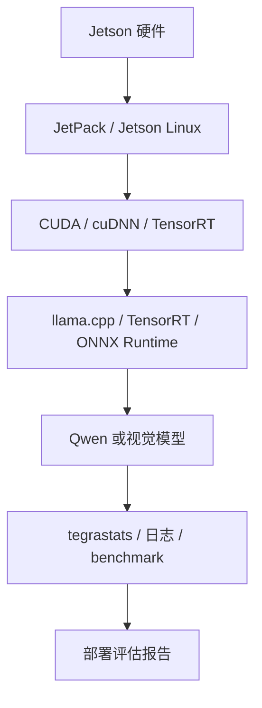

# Jetson 部署基础

## 建议学时

3 学时。1 学时讲 Jetson 硬件与 JetPack 环境，1 学时讲功耗、温度和 profiling，1 学时讲 Jetson 与 Ubuntu Server 实作路径差异。

## 学习目标

- 理解 Jetson 是边缘端侧设备，不是普通 Ubuntu 服务器的缩小版。
- 掌握 JetPack、CUDA、TensorRT、`tegrastats`、功耗模式等关键概念。
- 能把 Ubuntu Server 上的 Qwen/llama.cpp 实验迁移到 Jetson，并记录差异。
- 能解释 Jetson 上显存、共享内存、功耗、温度和热降频对推理的影响。

## Jetson 环境链路



## 核心概念

| 项目 | Ubuntu Server + NVIDIA GPU | Jetson |
| --- | --- | --- |
| GPU | 独立 GPU 常见 | 嵌入式 GPU，和系统共享资源 |
| 内存 | 通常有独立显存 | 统一/共享内存更常见 |
| 功耗 | 通常不是第一约束 | 功耗模式和散热是核心变量 |
| 工具 | `nvidia-smi` | `tegrastats`、`nvpmodel`、`jetson_clocks` |
| Runtime | llama.cpp、TensorRT、ONNX Runtime | llama.cpp、TensorRT、Jetson 优化栈 |

## 代码/命令示例

Jetson 基础检查：

```bash
cat /etc/nv_tegra_release
uname -a
python3 --version
tegrastats
```

功耗模式和频率检查：

```bash
sudo nvpmodel -q
sudo jetson_clocks --show
```

运行 llama.cpp 时记录 `tegrastats`：

```bash
tegrastats --interval 1000 | tee ~/edge-ai-lab/logs/jetson-tegrastats.txt
```

## 实验或演示

对应实作：[Jetson 环境与 Qwen 迁移](/docs/lab-jetson-setup)。

课堂演示重点：

- 同一 Qwen GGUF 模型在 Ubuntu Server 和 Jetson 上的加载、速度、内存差异。
- 同一 ctx-size 在 Jetson 上对内存和温度的影响。
- 功耗模式改变后，tokens/s 和温度是否变化。

## 作业/检查题

- 为什么 Jetson 上不能只看 tokens/s，还要看温度和功耗？
- `nvidia-smi` 和 `tegrastats` 的定位有什么不同？
- 哪些任务适合 Jetson 本地跑，哪些更适合端云协同？

## 取舍说明

本章吸收 NVIDIA Jetson、JetPack、TensorRT 和 Jetson AI Lab 的部署思路，但不讲所有 Jetson 型号差异，也不展开板级硬件设计。课程关注的是：如何把模型放到 Jetson 上运行、如何记录性能和功耗、如何判断方案是否适合端侧产品。

## 参考资料

- [NVIDIA Jetson documentation](https://docs.nvidia.com/jetson/)
- [Jetson AI Lab](https://www.jetson-ai-lab.com/)
- [TensorRT documentation](https://docs.nvidia.com/deeplearning/tensorrt/latest/)
- [NVIDIA JetPack SDK](https://developer.nvidia.com/embedded/jetpack)
