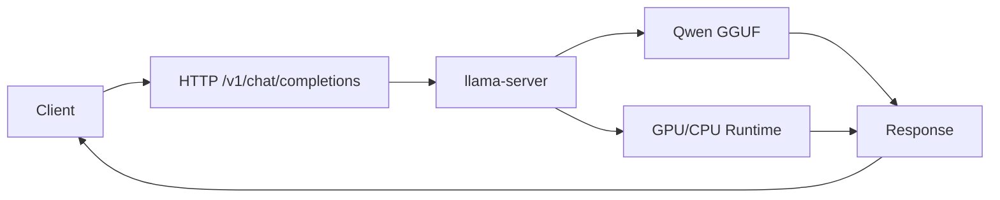

# 本地 OpenAI-compatible 服务

## 学习目标

- 用 llama.cpp 启动本地 OpenAI-compatible API。
- 用 Python 客户端完成 smoke test。
- 把模型推理从 CLI 推进到可被应用、VLM 或 Agent 调用的服务形态。

## 问题背景

课程前面的实验解决“模型能否在本机跑起来”。真实应用还需要服务接口、超时处理、错误日志和调用边界。本章先做最小服务化验证，不展开复杂并发和鉴权。

## 图示讲解



## 核心概念

| 项目 | 第一阶段要求 | 后续扩展 |
| --- | --- | --- |
| API | 本地可调用 | 鉴权、限流、日志 |
| 超时 | smoke test 可控 | 请求队列、取消生成 |
| 模型 | 单模型服务 | 多模型 routing |
| 安全 | 本机或内网验证 | 权限隔离、工具调用审计 |

## 代码/命令示例

启动服务：

```bash
./build/bin/llama-server \
  -m ~/edge-ai-lab/models/qwen/qwen2.5-1.5b-instruct-q4_k_m.gguf \
  -ngl 99 \
  --ctx-size 2048 \
  --host 0.0.0.0 \
  --port 8080
```

用 `curl` 验证：

```bash
curl http://localhost:8080/v1/chat/completions \
  -H "Content-Type: application/json" \
  -d '{
    "model": "qwen-local",
    "messages": [
      {"role": "user", "content": "用三句话解释端侧模型量化。"}
    ],
    "temperature": 0.2,
    "max_tokens": 128
  }'
```

## 配套实作

运行仓库中的 Python smoke test：

```bash
python3 labs/scripts/openai_compatible_smoke_test.py \
  --base-url http://localhost:8080/v1 \
  --prompt "用三句话解释端侧模型量化。"
```

## 验收结果

| 产物 | 验收标准 |
| --- | --- |
| server 日志 | 模型加载成功，无明显 fallback/OOM |
| curl 响应 | 返回 chat completion JSON |
| Python smoke test | 正常打印模型回答 |

## 常见问题

- **服务端口不可访问**：确认 server 是否绑定到正确 host/port。
- **请求返回但内容异常**：检查模型路径、chat template 和采样参数。
- **API 成功但应用慢**：服务化后还要单独测网络、序列化和并发排队开销。

## 参考资料

- [llama.cpp server](https://github.com/ggml-org/llama.cpp)
- [Qwen llama.cpp 本地运行指南](https://qwen.readthedocs.io/en/v2.5/run_locally/llama.cpp.html)
