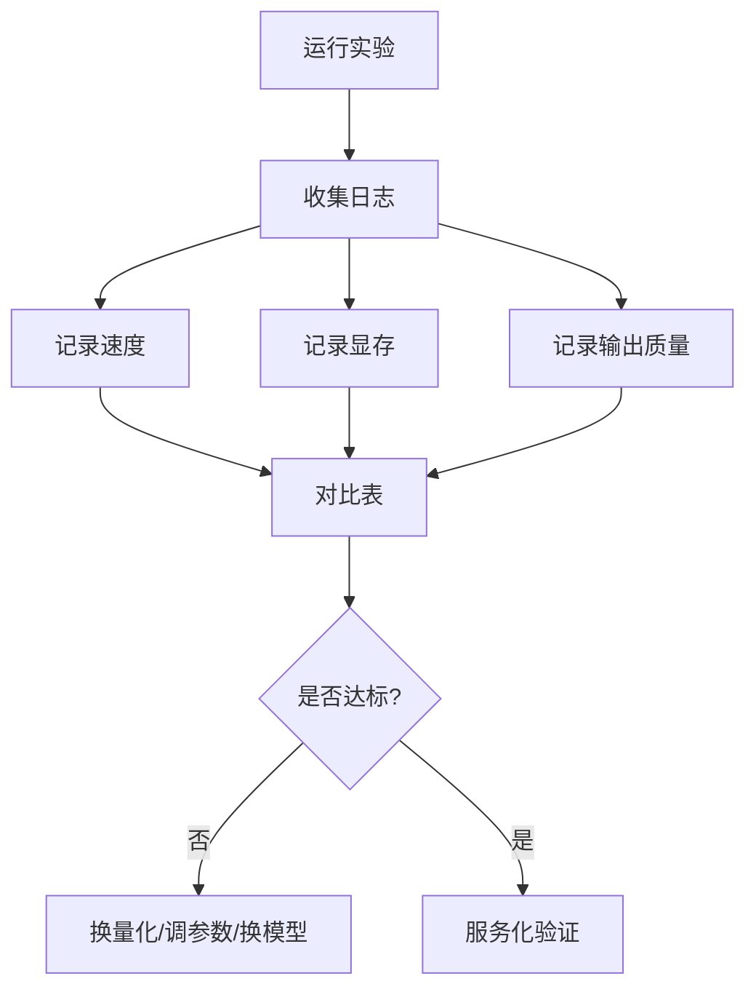

# Profiling 与结果记录

## 学习目标

- 把端侧部署结果拆成质量、速度、显存、功耗/温度和稳定性。
- 区分首 token、prefill、decode 和稳定 tokens/s。
- 建立可复查的实验记录模板。

## 问题背景

“跑起来了”不是验收标准。端侧部署要证明模型在真实设备上稳定达到业务可用标准。对小型 LLM 来说，首 token 决定交互等待感，tokens/s 决定生成流畅度，KV Cache 决定长上下文能力，VRAM/RAM 决定能否常驻。

## 图示讲解



## 核心概念

| 指标 | 含义 | 记录建议 |
| --- | --- | --- |
| 首 token 延迟 | 从请求到第一个 token 的等待 | 单独记录 |
| tokens/s | decode 阶段生成速度 | 多次运行取中位数更稳 |
| 峰值 VRAM | 推理过程 GPU 显存高点 | 结合 `nvidia-smi` |
| 输出质量 | 是否满足任务 | 固定 prompt + 备注 |
| 失败日志 | fallback、OOM、格式错误 | 保存原始日志 |

## 代码/命令示例

运行时用另一窗口观察显存：

```bash
watch -n 0.5 nvidia-smi
```

保存 profiling 记录模板：

```bash
cp labs/templates/profiling-results.md ~/edge-ai-lab/results/profiling-results.md
```

## 配套实作

为每个量化变体至少记录一次完整结果。课堂中不追求严格统计显著性，但要保证每次运行条件相同。

建议结果表：

| 模型 | 量化 | ctx | 文件大小 | 峰值 VRAM | 首 token | tokens/s | 质量备注 |
| --- | --- | --- | --- | --- | --- | --- | --- |
| 待填 | 待填 | 待填 | 待填 | 待填 | 待填 | 待填 | 待填 |

## 验收结果

| 产物 | 验收标准 |
| --- | --- |
| profiling 表 | 至少三行模型结果，字段完整 |
| 日志目录 | 每次实验有对应原始日志 |
| 结论段落 | 明确推荐量化格式和不推荐原因 |

## 常见问题

- **只跑一次就下结论**：第一次运行可能受缓存、温度或系统负载影响。
- **混用不同采样参数**：温度、top-p、生成长度变化会影响输出和速度。
- **不保存失败日志**：失败日志往往比成功结果更能解释下一步优化方向。

## 参考资料

- [llama.cpp 项目](https://github.com/ggml-org/llama.cpp)
- [NVIDIA CUDA Installation Guide for Linux](https://docs.nvidia.com/cuda/cuda-installation-guide-linux/)
