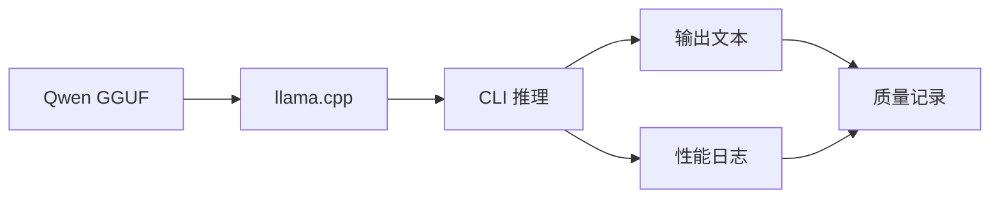

# Qwen 基线推理

## 学习目标

- 构建启用 CUDA 的 llama.cpp。
- 下载或准备 Qwen 小模型 GGUF 文件。
- 用固定 prompt 建立可复查的 baseline 输出。
- 记录首 token、tokens/s、显存和输出质量。

## 问题背景

量化对比之前必须先有 baseline。baseline 不只是“模型能说话”，还包括固定 runtime、固定 prompt、固定上下文、固定采样参数和可复查日志。

## 图示讲解



## 核心概念

| 项目 | 建议固定 | 原因 |
| --- | --- | --- |
| Prompt | 使用课程给定 prompt | 避免输入差异干扰比较 |
| 上下文 | 例如 2048 | KV Cache 和显存会随上下文变化 |
| 生成长度 | 例如 128 token | 避免输出长度影响 tokens/s |
| GPU 层数 | 例如 `-ngl 99` | 明确是否尽量 offload 到 GPU |
| 模型路径 | 写入实验表 | 便于复查具体 GGUF 文件 |

## 代码/命令示例

构建 llama.cpp：

```bash
cd ~/edge-ai-lab/src
git clone https://github.com/ggml-org/llama.cpp.git
cd llama.cpp
cmake -B build -DGGML_CUDA=ON
cmake --build build --config Release -j
```

运行 baseline：

```bash
./build/bin/llama-cli \
  -m ~/edge-ai-lab/models/qwen/qwen2.5-1.5b-instruct-q8_0.gguf \
  -p "用三句话解释端侧模型量化的价值。" \
  -n 128 \
  -ngl 99 \
  --ctx-size 2048 \
  2>&1 | tee ~/edge-ai-lab/logs/qwen-baseline-q8.txt
```

> 模型文件名按实际下载结果调整。本书不提交模型权重。

## 配套实作

完成一次 Q8 或其他高精度 GGUF 的 baseline 推理，并把输出填入 `labs/templates/profiling-results.md`。

## 验收结果

| 产物 | 验收标准 |
| --- | --- |
| llama.cpp 构建目录 | `build/bin/llama-cli` 可运行 |
| baseline 日志 | 包含模型加载、生成输出和性能统计 |
| baseline 质量备注 | 能说明输出是否满足固定 prompt |

## 常见问题

- **没有固定模型版本**：同名 Qwen 模型不同来源可能量化类型、chat template 和质量不同。
- **prompt 太随意**：baseline 要用后续量化对比会复用的 prompt。
- **只保存终端截图**：尽量保存文本日志，便于搜索和对比。

## 参考资料

- [Qwen llama.cpp 本地运行指南](https://qwen.readthedocs.io/en/v2.5/run_locally/llama.cpp.html)
- [llama.cpp build docs](https://github.com/ggml-org/llama.cpp/blob/master/docs/build.md)
