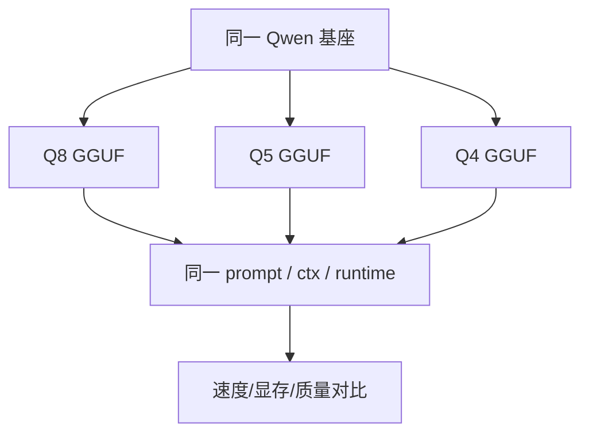

# Qwen GGUF 量化对比实验

## 学习目标

- 用同一套条件比较 Qwen GGUF 的不同量化格式。
- 观察文件大小、VRAM、首 token、tokens/s 和输出质量之间的取舍。
- 建立“不预设结果，只记录真实设备数据”的实验习惯。

## 问题背景

Q8、Q5、Q4 等 GGUF 变体通常会带来不同的文件大小和运行特征，但具体收益取决于模型、runtime、GPU offload、上下文长度和设备。课程不预置性能数字，而是让学员在自己的设备上记录。

## 图示讲解



## 核心概念

| 变量 | 必须保持一致吗 | 说明 |
| --- | --- | --- |
| Prompt | 是 | 否则无法比较质量 |
| `--ctx-size` | 是 | 影响 KV Cache 和显存 |
| `-n` | 是 | 影响生成长度和速度统计 |
| `-ngl` | 是 | 影响 GPU offload |
| 模型基座 | 是 | 不同模型尺寸不能直接比较量化格式 |

## 代码/命令示例

把不同量化文件放在同一目录：

```bash
ls -lh ~/edge-ai-lab/models/qwen/*.gguf
```

分别运行同一 prompt：

```bash
for model in \
  qwen2.5-1.5b-instruct-q8_0.gguf \
  qwen2.5-1.5b-instruct-q5_k_m.gguf \
  qwen2.5-1.5b-instruct-q4_k_m.gguf
do
  ./build/bin/llama-cli \
    -m ~/edge-ai-lab/models/qwen/${model} \
    -p "用三句话解释端侧模型量化的价值。" \
    -n 128 \
    -ngl 99 \
    --ctx-size 2048 \
    2>&1 | tee ~/edge-ai-lab/logs/${model}.log
done
```

## 配套实作

把每个模型的结果填入：

```bash
cp labs/templates/profiling-results.md ~/edge-ai-lab/results/qwen-quantization-results.md
```

记录至少三类结果：

- 文件大小和峰值 VRAM。
- 首 token 延迟和 tokens/s。
- 输出质量备注，包括是否跑题、重复、格式错误或明显事实错误。

## 验收结果

| 产物 | 验收标准 |
| --- | --- |
| 三个模型日志 | 至少包含 Q8/Q5/Q4 或同等层级的三个量化变体 |
| 对比表 | 每行都有文件大小、显存、速度和质量备注 |
| 实验结论 | 能说明当前设备上推荐哪个量化格式，以及为什么 |

## 常见问题

- **量化格式和模型尺寸一起变**：比较 Q8/Q4 时应尽量保持同一模型基座。
- **只看速度不看质量**：低比特模型如果格式错误增多，速度收益不一定可用。
- **不同上下文长度混用**：ctx 变了，KV Cache 和 prefill 成本也变了。

## 参考资料

- [Qwen llama.cpp 量化指南](https://qwen.readthedocs.io/en/v2.5/quantization/llama.cpp.html)
- [llama.cpp quantize README](https://github.com/ggml-org/llama.cpp/blob/master/tools/quantize/README.md)
