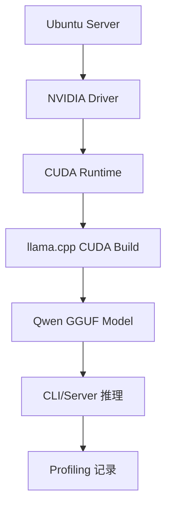

# Ubuntu Server 与 NVIDIA GPU 环境

## 学习目标

- 建立可复查的 Ubuntu Server 实验基线。
- 确认 NVIDIA 驱动、CUDA runtime、Python、编译工具和磁盘空间。
- 把课程仓库、模型权重、第三方源码和构建产物分开管理。

## 问题背景

很多部署问题并不是模型问题，而是环境问题：驱动版本不匹配、CUDA 不可见、磁盘不足、模型权重放错目录、构建时没有启用 GPU 后端。实作第一步是把机器状态记录清楚。

## 图示讲解



## 核心概念

| 项目 | 需要确认 | 失败表现 |
| --- | --- | --- |
| 驱动 | `nvidia-smi` 正常显示 GPU | CUDA 不可见、GPU offload 失败 |
| CUDA | 编译和运行时版本可用 | llama.cpp 只能 CPU 跑 |
| 编译工具 | `cmake`、编译器、Git 可用 | 无法构建 runtime |
| 磁盘 | 有足够空间放模型和构建产物 | 下载或编译中断 |
| 网络 | 能访问模型来源 | 无法获取 GGUF 文件 |

## 代码/命令示例

```bash
mkdir -p ~/edge-ai-lab/{models,src,logs,results}
cd ~/edge-ai-lab

uname -a
lscpu
free -h
df -h
nvidia-smi
python3 --version
cmake --version
git --version
```

可选：如果课程环境使用容器，再检查 NVIDIA Container Toolkit。容器不是本课程第一阶段的硬性要求。

```bash
docker run --rm --gpus all nvidia/cuda:12.4.1-base-ubuntu22.04 nvidia-smi
```

## 配套实作

运行仓库中的环境检查脚本，生成一份可提交到实验记录的文本：

```bash
bash labs/scripts/env_check.sh | tee ~/edge-ai-lab/results/env-check.txt
```

## 验收结果

| 产物 | 验收标准 |
| --- | --- |
| `env-check.txt` | 包含 OS、CPU、内存、磁盘、GPU、Python、CMake、Git 信息 |
| 实验目录 | `models`、`src`、`logs`、`results` 分离 |
| GPU 可见性 | `nvidia-smi` 能正常运行 |

## 常见问题

- **把模型权重放进课程仓库**：模型文件和第三方源码应放在 `~/edge-ai-lab`，不要提交到 Git。
- **驱动可见但编译没启 CUDA**：`nvidia-smi` 正常不代表 llama.cpp 已启用 CUDA。
- **容器能跑但宿主机不能跑**：容器和宿主机的 CUDA runtime、库路径需要分开排查。

## 参考资料

- [Ubuntu Server NVIDIA driver guide](https://ubuntu.com/server/docs/how-to/graphics/install-nvidia-drivers/)
- [NVIDIA CUDA Installation Guide for Linux](https://docs.nvidia.com/cuda/cuda-installation-guide-linux/)
- [NVIDIA Container Toolkit Install Guide](https://docs.nvidia.com/datacenter/cloud-native/container-toolkit/latest/install-guide.html)
